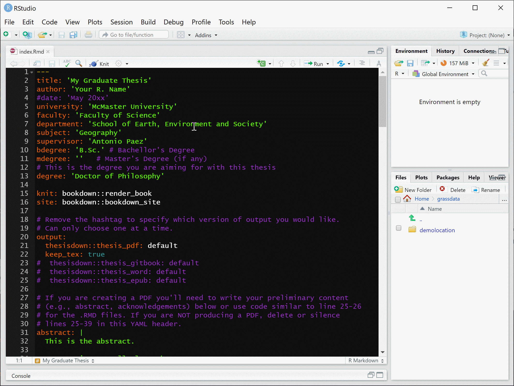

<!-- README.md is generated from README.Rmd. Please edit that file -->

```{r, include = FALSE}
knitr::opts_chunk$set(
  collapse = TRUE,
  comment = "#>",
  fig.path = "man/figures/README-",
  out.width = "100%"
)
```

# macdown 

This project is inspired by the [bookdown](https://github.com/rstudio/bookdown) and [thesisdown](https://github.com/ismayc/thesisdown) packages, adapted to provide a template for writing a McMaster graduate thesis in R markdown. This is work in progress.

Currently, the PDF uses McMaster Graduate Thesis LaTeX template. The gitbook version is fully-functional. The Word and epub versions have no templates behind them, and are essentially calls to the appropriate functions in bookdown.

If you are new to working with {bookdown}/{rmarkdown}, please read over the documentation available in the `gitbook` template at https://thesisdown.netlify.com/.  This is also available at https://ismayc.github.io/thesisdown_book.

<!--
The current output for the four versions is here:
- [PDF](https://github.com/ismayc/thesisdown_book/blob/gh-pages/thesis.pdf) (Generating LaTeX file is available [here](https://github.com/ismayc/thesisdown_book/blob/gh-pages/thesis.tex) with other files in the [book directory](https://github.com/ismayc/thesisdown_book/tree/gh-pages).)
- [Word](https://github.com/ismayc/thesisdown_book/blob/gh-pages/thesis.docx)
- [ePub](https://github.com/ismayc/thesisdown_book/blob/gh-pages/thesis.epub)
- [gitbook](https://ismayc.github.io/thesisdown_book)
-->

Under the hood, the McMaster Graduate Thesis LaTeX template is used to ensure that documents conform precisely to submission standards. At the same time, composition and formatting can be done using lightweight [{markdown}](https://rmarkdown.rstudio.com/authoring_basics.html) syntax, and `R` code and its output can be seamlessly included using [{rmarkdown}](https://rmarkdown.rstudio.com).

### Using macdown

Using {macdown} has some prerequisites which are described below. To compile PDF documents using `R`, you are going to need to have LaTeX installed. By far the easiest way to install LaTeX on any platform is with the [{tinytex}](https://yihui.name/tinytex/) R package:

```{r eval=FALSE}
install.packages(c('tinytex', 'rmarkdown'))
tinytex::install_tinytex()
# after restarting RStudio, confirm that you have LaTeX with 
tinytex:::is_tinytex() 
```

You may need to install a few extra LaTeX packages on your first attempt to knit as well. Here is one such example of how to do so:

```{r eval=FALSE}
tinytex::tlmgr_install("babel-portuges")
```

To use {macdown} from [RStudio](https://www.rstudio.com/products/rstudio/download/):

1) Ensure that you have already installed LaTeX and the fonts described above, and are using the latest version of [RStudio](https://www.rstudio.com/products/rstudio/download/). You can use {macdown} without RStudio. For example, you can write the Rmd files in your favourite text editor (e.g. [Atom](https://atom.io/), [Notepad++](https://notepad-plus-plus.org/)). But RStudio is probably the easiest tool for writing both `R` code and text in your thesis. It also provides a nice way to build your thesis while editing. We'll proceed assuming that you have decided to use the RStudio workflow.

2) Install the {bookdown} and {macdown} packages. Note that {macdown} is not available on CRAN and `install.packages("macdown")` will not work. Use `remotes::install_github()` as shown below instead to install the package.

```{r eval=FALSE}
if (!require("remotes")) 
  install.packages("remotes", 
                   repos = "https://cran.rstudio.org")
if (!require("bookdown")) 
  install.packages("bookdown", 
                   repos = "https://cran.rstudio.org")
remotes::install_github("paezha/macdown")
```

Note that you may need to restart RStudio at this point before the template becomes available in the menu.

3) Create a project to work on your thesis! Do not nest your thesis as part of another project, since this will confuse the directory structure.

4) Use the **New R Markdown** dialog to select macdown **Thesis**:


Note that this will currently only **Knit** if you name the document `index` as shown above.

5) Customize the information for the thesis in the YAML at the top of index.Rmd. There you can enter your name, title of the thesis, abstract, etc.




6) Create R markdown documents with the content of your thesis. Each chapter could be a separate R markdown document. To include in the thesis, use chunks in `index.rmd` as follows:

```

```

**Knit** the `index.Rmd` file to get the thesis in PDF format.

<!--
### Day-to-day writing of your thesis 

You need to edit the individual chapter R Markdown files to write your thesis. It's recommended that you version control your thesis using GitHub if possible. RStudio can also easily sync up with GitHub to make the process easier. While writing, you should `git commit` your work frequently, after every major activity on your thesis. For example, every few paragraphs or section of text, and after major step of analysis development. You should `git push` at the end of each work session before you leave your computer or change tasks. For a gentle, novice-friendly guide to getting starting with using Git with R and RStudio, see <https://happygitwithr.com/>.

--> 

## Rendering

To render your thesis into a PDF, open `index.Rmd` in RStudio and then click the "knit" button. To change the output formats between PDF, gitbook and Word , look at the `output:` field in `index.Rmd` and comment-out the formats you don't want.

The PDF file of your thesis will be deposited in the `_book/` directory, by default.

## Components

The following components are ones you should edit to customize your thesis:

### `_bookdown.yml`

This is the main configuration file for your thesis. You can change the name of your outputted file here and other options about your thesis here.

### `index.Rmd`

This file contains all the meta information that goes at the beginning of your document. You'll need to edit the top portion of this file (the YAML) to put your name on the first page, the title of your thesis, etc. Note that you need to have at least one chapter start in the `index.Rmd` file for the build to work. For the template, this is done with `# Preface` in the example from the template.

### `01-chap1.Rmd`, `02-chap2.Rmd`, etc.

These are the Rmd files for each chapter in your dissertation. Write your thesis in these. If you're writing in RStudio, you may find the [wordcount addin](https://github.com/benmarwick/wordcountaddin) useful for getting word counts and readability statistics in R Markdown documents.

### `bib/`

Store your bibliography (as bibtex files) here. We recommend using the [citr addin](https://github.com/crsh/citr) and [Zotero](https://www.zotero.org/) to efficiently manage and insert citations. 

### `csl/`

Specific style files for bibliographies should be stored here. A good source for
citation styles is https://github.com/citation-style-language/styles#readme.

### `figure/` and `data/`

Store your figures and data here and reference them in your R Markdown files. See the [bookdown book](https://bookdown.org/yihui/bookdown/) for details on cross-referencing items using R Markdown.

